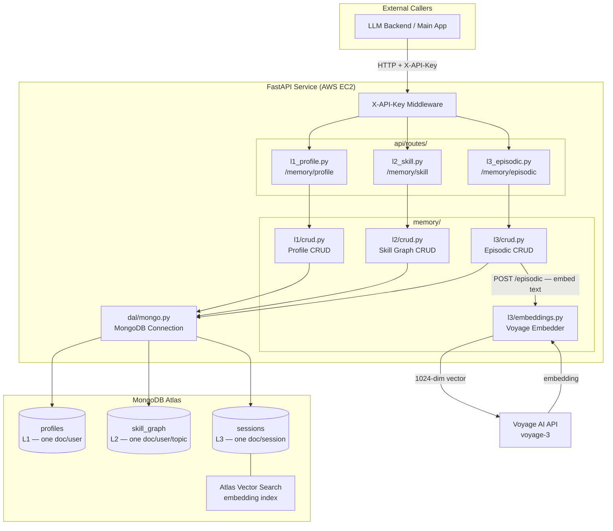
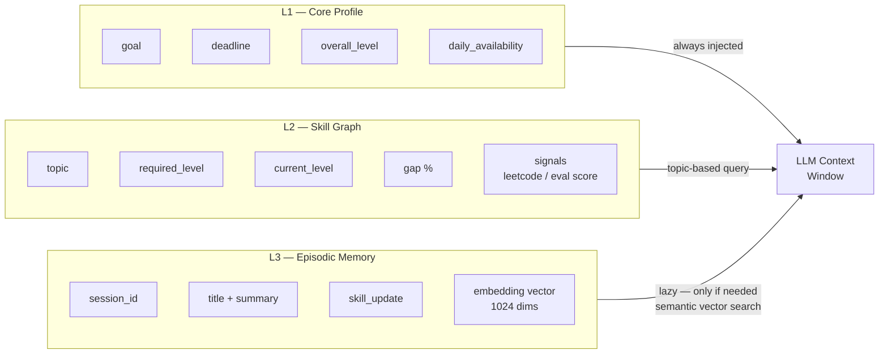
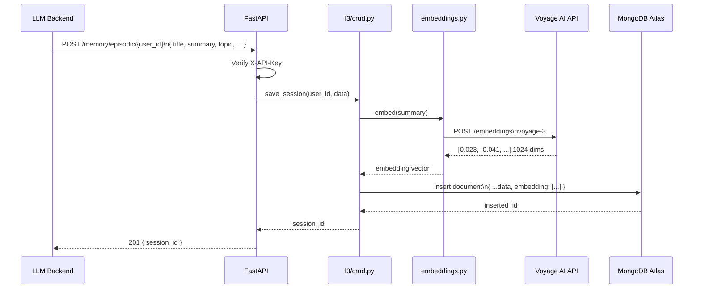
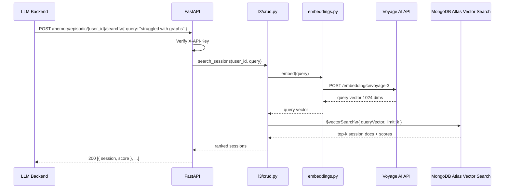

# layered-memory-service — Architecture

## System Overview

---

## Memory Layers

---

## Request Flow — POST /memory/episodic (save session)

---

## Request Flow — POST /memory/episodic/{user_id}/search

